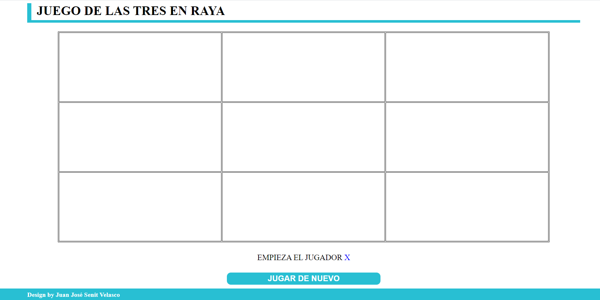
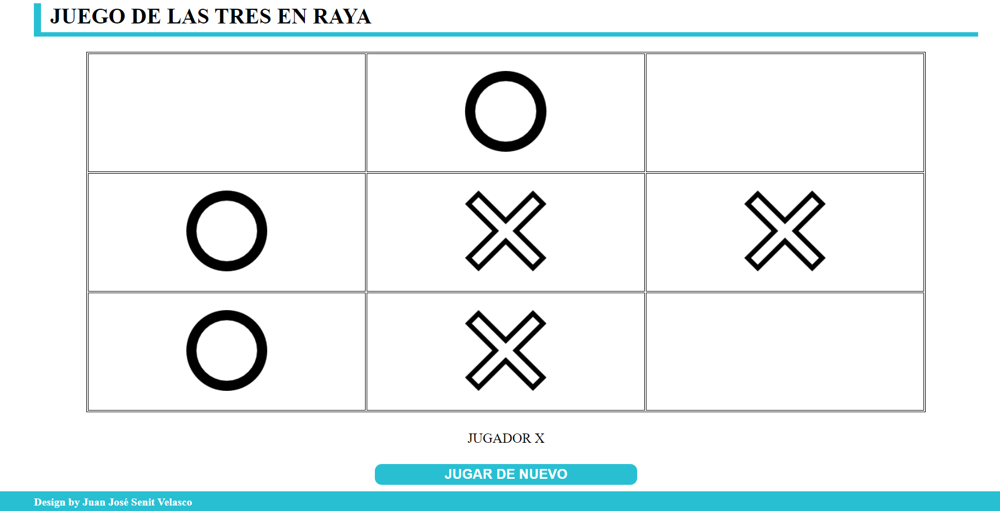
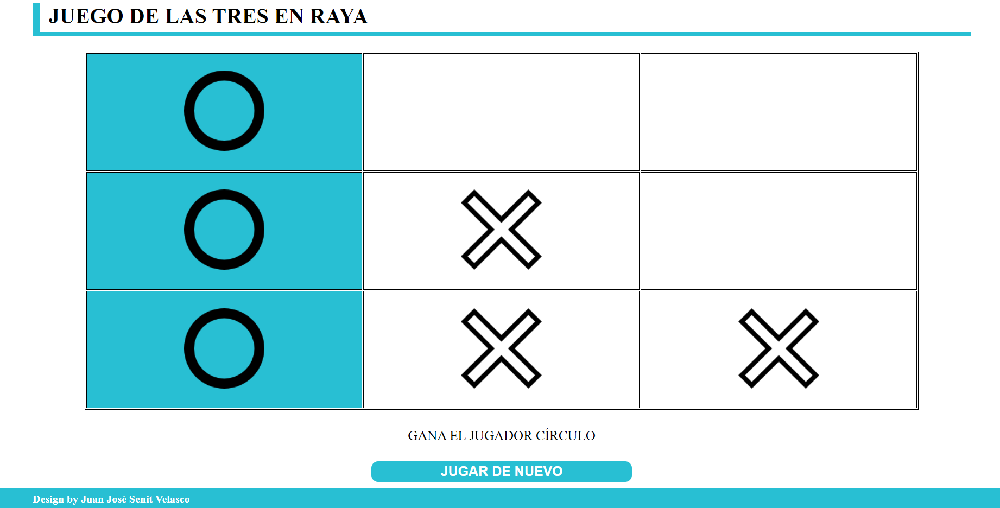

# TRES EN RAYA

El clásico juego de las tres en raya. Dos jugadores (aspa o círculo) se enfrentan por ser el primero en hacer tres en raya. Cada jugador dispone de tres fichas (aspas o círculos). En las 6 primeras rondas van introduciendo, por turnos, una ficha cada jugador. Acabados estos turnos, van moviendo las fichas situadas en el tablero, por turnos, hasta hacer las tres en raya.
___
## DESARROLLO DE UNA PARTIDA

En la primera imagen se muestra el tablero inicial, con el jugador que empieza

En la segunda imagen, cada jugador ha introducido sus tres fichas (por turnos) y al no conseguir ninguno de ellos hacer tres en raya, comienzan a mover una pieza cada uno por turnos hasta que alguno de ellos gane

En la tercera se observa el final de una partida, en la cual ha ganado el jugador círculo, ya que ha conseguido realizar las 3 en raya, marcándose el resultado ganador
___
## CÓMO JUGAR
Existen varias alternativas para ejecutar el juego:
1. Clonar el repositorio y **ejecutar** el **index.html**
2. Aprovechando la herramienta de GitHub Pages desde el siguiente enlace: